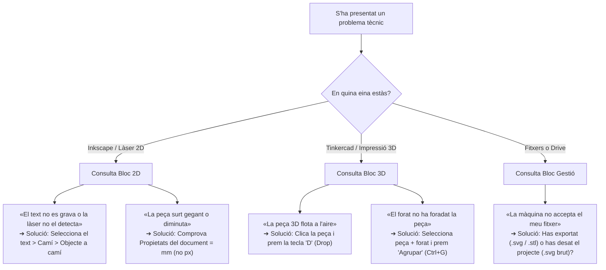
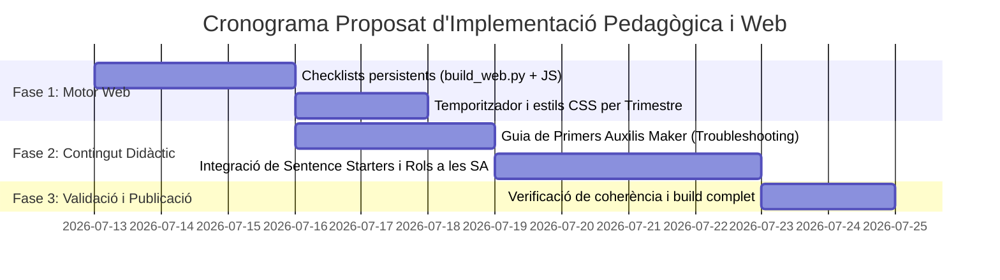

# Informe Executiu: Pla de Desenvolupament i Millora Pedagògica i Tècnica

**Projecte:** Aula Maker — Optativa de 1r d’ESO (Curs 2026-2027)  
**Data d'elaboració:** Juliol 2026  
**Àmbit del document:** Desenvolupament teòric, curricular, didàctic i de disseny digital (UX/UI) explicat al mínim detall.

---

## 1. Resum Executiu i Diagnòstic Pedagògic

El projecte **Aula Maker 1r d'ESO** parteix d'una base didàctica d'alta qualitat, alineada amb el currículum LOMLOE (Decret 175/2022), amb una excel·lent temporització en 35 setmanes i una cultura d'aula basada en la seguretat (Carnets 🔴🟠🟢🔵) i la desestigmatització de l'error (*Museu dels Errors*).

Per fer el salt d'un material **molt bo** a un material **d'excel·lència pedagògica de referència**, cal incidir en les característiques evolutives i cognitives pròpies de l'alumnat de **1r d'ESO (12–13 anys)**:

1. **Inmaduresa de les funcions executives:** Necessiten bastides visuals i rutines predeterminades per organitzar passos, temps i arxius digitals.
2. **Baixa tolerància a la frustració tecnològica:** Davant un error en el programari de disseny (Inkscape/Tinkercad), tendeixen a la indefensió o a dependre al 100% de la intervenció docent.
3. **Riscos en el treball cooperatiu lliure:** Sense rols molt estructurats, els perfils amb major autopercepció digital o impulsivitat monopolitzen les eines, generant bretxes de participació i de gènere.

---

## 2. Bloc 1: Bastides Cognitives i Autonomia Tècnica (Scaffolding)

### 2.1. Guia Visual "Primers Auxilis Maker" (*Troubleshooting* autònom)

**Justificació pedagògica:**  
A 1r d'ESO, el 70% de les consultes al docent durant les sessions de disseny són errors recurrents i predictibles. Crear una eina de resolució autònoma apodera l'alumnat, fomenta la competència digital i allibera el docent per fer acompanyament pedagògic de fons.

#### Flux de decisió per a l'alumnat



#### Desglossament detallat per seccions de la Guia

* **Secció A — Inkscape i Talladora Làser (2D):**
  1. *«He escrit un text però la làser no el talla ni el grava»* → **Diagnòstic:** El text és una font tipogràfica, no un vector. → **Solució:** Menú **Camí > Objecte a camí**.
  2. *«La línia vermella no es talla, es grava»* → **Diagnòstic:** El color o el gruix no són normatius. → **Solució:** Establir color de traç a **RGB (255, 0, 0)** i gruix a **0,1 mm**.
  3. *«En moure una forma, se me'n va tot de lloc»* → **Diagnòstic:** Eines d'ajust automàtic (*snapping*) massa agressives. → **Solució:** Desactivar temporalment l'imant superior d'Inkscape o prémer `Shift` en moure.
* **Secció B — Tinkercad i Impressora 3D:**
  1. *«La impressora 3D farà 'spaghetti' perquè la peça està flotant»* → **Diagnòstic:** Z > 0 mm. → **Solució:** Seleccionar l'objecte i prémer la tecla **D** (*Drop to workplane*).
  2. *«He posat un cilindre transparent dins un cub però no hi ha forat»* → **Diagnòstic:** Falta operació booleana. → **Solució:** Seleccionar tots dos cossos i clicar a **Agrupar (`Ctrl+G`)**.
  3. *«La paret de la meva capsa es trenca en imprimir»* → **Diagnòstic:** Gruix inferior a 1,2 mm. → **Solució:** Utilitzar el regle de Tinkercad i assegurar un gruix mínim de **2 mm** per a estructures.
* **Secció C — Arxius, Noms i Drive:**
  1. *«No trobo el meu fitxer al Drive de l'equip»* → Protocol de cerca i regla d'or de desat al núvol.

---

### 2.2. Protocol Pre-Fabricació: "El Semàfor Maker"

**Justificació pedagògica:**  
Abans d'enviar un fitxer a la talladora làser o a la impressora 3D, l'alumne ha d'assumir la responsabilitat del control de qualitat per evitar malbaratament de material (temps-màquina i filament/fusta).

| Fase | Indicador | Comprovació física / digital per part de l'alumne | Acció si és incorrecte |
| :--- | :--- | :--- | :--- |
| 🟢 **VERD** | **Viabilitat i Mides Reals** | L'alumne agafa un regle o peu de rei, mesura sobre el seu esbós en paper i verifica que el fitxer digital fa **exactament els mil·límetres previstos** (ex.: $60 \times 25\text{ mm}$, no $600\text{ mm}$). | Redimensionar amb cadenat de proporció tancat. |
| 🟡 **GROC** | **Capes i Codi de Colors** | A Inkscape: contorn de tall = Vermell pur (`#FF0000`), gravat = Negre (`#000000`). A Tinkercad: base plana recolzada al sòl, sense buits interns invisibles. | Corregir traç / aplicar tecla `D`. |
| 🔴 **VERMELL** | **Nom Normatiu i Destí** | El fitxer compleix estrictament la sintaxi del curs: `NomAlumne_SAx_vN.ext` (ex.: `Marc_SA3_v2.svg`) i està pujat a la carpeta de Drive de la SA. | Canviar nom (*Anomena i desa*) abans de cridar el docent. |

---

## 3. Bloc 2: Metacognició i Profunditat en el Diari de Taller

### 3.1. Indicadors d'Inici Pautats (*Sentence Starters*)

**Justificació pedagògica:**  
A l'edat de 12 anys, la pregunta oberta *"Què has après avui?"* en els darrers 5 minuts de classe produeix respostes superficials. Cal oferir estructures sintàctiques que guiïn l'anàlisi del procés, l'error i la decisió tècnica.

```markdown
### 🧩 A. Rutines per a sessions de DISSENY I IDEACIÓ
- «Avui he escollit aquesta solució/forma perquè resol el problema de...»
- «El requisit tècnic que avui m'ha costat més complir és ______________ i ho he aconseguit fent...»
- «Abans pensava que dissenyar en [2D/3D] era ______________, però avui m'he adonat que...»

### 🔧 B. Rutines per a sessions de FABRICACIÓ I ITERACIÓ
- «Quan he comprovat la primera peça física / mostra, he descobert que l'encaix o la mida...»
- «El meu error tècnic d'avui ha estat ______________. La causa era ______________ i l'he corregit...»
- «Una decisió que he pres avui per treballar amb més seguretat o precisió ha estat...»

### 🎯 C. Rutines de TANCAMENT DE SA (Autoavaluació)
- «Si hagués de tornar a començar aquest projecte demà, el primer canvi que faria seria...»
- «El que m'ha fet sentir més orgullós/osa de la meva peça final és...»
```

---

### 3.2. Tiquet de Sortida (*Exit Ticket*) i Termòmetre d'Autonomia

Per tancar cada sessió de manera àgil (2 minuts finals), s'introdueix un micro-registre visual que connecta amb la **Rúbrica Amigable (`🌱🙂💪🌟`)**:

* 🌱 **Llavors:** *Avui he necessitat ajuda contínua del docent per avançar.*
* 🙂 **Brot:** *He seguit els passos de la fitxa però m'he encallat en un punt tècnic.*
* 💪 **Arbre:** *He resolt els problemes consultant la Guia o els companys/es de manera autònoma.*
* 🌟 **Bosc:** *He acabat el meu repte autònomament i he ajudat un company/a a desbloquejar-se.*

---

## 4. Bloc 3: Dinàmiques Cooperatives Inclusives i Perspectiva STEM

### 4.1. Rols Cooperatius Rotatius amb Insígnia (SA3, SA6, SA9)

**Justificació pedagògica:**  
En projectes cooperatius de fabricació, si no s'assignen responsabilitats clares, es reprodueixen rols passius. L'establiment de **3 rols formals amb rotació obligatòria per sessió** garanteix l'equitat en l'adquisició de competències digitals i mecàniques.

| Rol d'Equip | Icona | Responsabilitat Principal (El que FA durant els 50') | Criteri d'Èxit de la Sessió |
| :--- | :---: | :--- | :--- |
| **Pilot de Disseny** | 🎨 | Controla el Chromebook, opera el programari (Inkscape/Tinkercad) i executa les modificacions digitals consensuades per l'equip. | El fitxer està net, sense elements duplicats i ben desat. |
| **Especialista de Qualitat i Seguretat** | 📏 | Contrasta el disseny digital amb la realitat física (regle, peu de rei, plantilles), verifica el *Semàfor Maker* i vigila el compliment de les normes d'aula. | Valida el checklist pre-màquina amb signatura abans de fabricar. |
| **Cronista i Gestor/a de Dades** | 📔 | Custodia la carpeta de Drive, comprova la nomenclatura normativa, fa les fotografies de procés per a la memòria i redacta l'acord diari al Diari. | Pujada del fitxer `vN` correcte i registre fotogràfic realitzat. |

> [!IMPORTANT]
> **Norma de Rotació:** Cap alumne pot repetir el rol de *Pilot de Disseny* dues sessions consecutives. El docent ho verifica al *Full de Seguiment de Grup*.

---

### 4.2. Càpsules "Inspira't": Referents Makers i Socials

Per dotar de sentit i context social el que es fabrica a l'aula, cada Situació d'Aprenentatge integrarà una breu càpsula documental (*Inspira't*):
* **SA1–SA3 (Identitat i 2D):** Exemples de disseny paramètric aplicat a senyalística accessible per a persones amb discapacitat visual (braille gravat a làser).
* **SA4–SA6 (Disseny 3D Funcional):** Referents de *protesisme obert* (ex.: projecte *e-NABLE* de pròtesis mecàniques impreses en 3D per joves) i dissenyadores industrials contemporànies.
* **SA7–SA8 (Immersiu i VR):** Aplicacions de la Realitat Virtual en preservació del patrimoni cultural i rehabilitació mèdica.

---

## 5. Bloc 4: Interactivitat i Millores de la Web Digital (`build_web.py` & `style.css`)

### 5.1. Checklists Interactius amb Persistència al Navegador (`localStorage`)

**Objectiu tècnic i d'UX:**  
Convertir les llistes de comprovació estàtiques de Markdown (`[ ]`) en elements interactius retinguts de manera persistent al navegador de l'alumne (Chromebook).

1. **Modificació del generador Python (`build_web.py`):**
   A la funció `checkboxify(html_text)`, en comptes de generar el caràcter estàtic `☐`, es generarà una estructura HTML amb identificador determinista basat en la ruta de la pàgina i l'índex de la tasca:
   ```html
   <li class="task-item">
     <label class="task-label">
       <input type="checkbox" class="task-check" data-task-id="sa1_fitxa_task_0">
       <span class="task-text">Text del requisit o pas de la SA</span>
     </label>
   </li>
   ```

2. **Lògica JavaScript de Persistència de Dades (a integrar a `render_page`):**
   ```javascript
   document.addEventListener('DOMContentLoaded', () => {
     const pageKey = window.location.pathname;
     const checkboxes = document.querySelectorAll('.task-check');
     
     checkboxes.forEach((chk) => {
       const storageKey = `maker_chk_${pageKey}_${chk.dataset.taskId}`;
       chk.checked = localStorage.getItem(storageKey) === 'true';
       if (chk.checked) chk.closest('.task-item').classList.add('completed');

       chk.addEventListener('change', (e) => {
         localStorage.setItem(storageKey, e.target.checked);
         e.target.closest('.task-item').classList.toggle('completed', e.target.checked);
       });
     });
   });
   ```

---

### 5.2. Eina de Control Horari: "El Rellotge Maker" (Temporitzador Visual)

* **Ubicació UI:** Botó `⏱️ Rellotge` situat a la barra de navegació superior al costat dels ajustos DUA.
* **Estats del Temporitzador:**
  * **Torn Estació 1 / Estació 2:** 50 minuts (compte enrere).
  * **Avís Visual (darrers 10 minuts):** Canvi suau del color de fons del temporitzador cap a l'accent taronja (`--amber`), indicant l'inici de la recollida de taller i redacció del Diari.

---

### 5.3. Codificació Visual per Trimestres i Màquines (`style.css`)

```css
/* Esquema de color pedagògic per insígnies i capçaleres de SA */
.badge-t1, .sa-card[data-trim="1"] {
  border-left: 4px solid #d93829; /* 🔴 Làser i Disseny 2D */
}
.badge-t2, .sa-card[data-trim="2"] {
  border-left: 4px solid #f5a623; /* 🟠 Modelatge i Impressió 3D */
}
.badge-t3, .sa-card[data-trim="3"] {
  border-left: 4px solid #2da44e; /* 🟢/🔵 Immersiu, 360 i VR */
}
```

---

## 6. Cronograma Proposat d'Implementació



---

## 7. Taula de Síntesi d'Impacte Pedagògic

| Àmbit de Millora | Problema Detectat a 1r d'ESO | Solució Desenvolupada | Impacte Esperat a l'Aula |
| :--- | :--- | :--- | :--- |
| **Autonomia Tècnica** | Dependència excessiva del professor davant errors de programari (coll d'ampolla). | **Guia *Primers Auxilis Maker*** amb arbres de decisió visuals. | Reducció estimada del 50% de les consultes tècniques trivials. |
| **Control de Qualitat** | Malbaratament de material (fusta/filament) per errors de mides o capes. | **Semàfor Maker** pre-fabricació obligatori de 3 passos. | Tolerància zero a fitxers mal anomenats o amb mides absurdes. |
| **Metacognició** | Escriptura superficial al Diari de Taller (*«m'ha agradat molt»*). | **Indicadors d'inici (*Sentence Starters*)** + Termòmetre `🌱🙂💪🌟`. | Entrades reflexives centrades en la causa de l'error i la solució. |
| **Equitat i Cooperació** | Monopoli del teclat/ratolí per part d'alumnes més compenetradors o impulsius. | **3 Rols Cooperatius Rotatius** amb responsabilitat única i verificada. | Participació equilibrada i eliminació de la bretxa digital/gènere. |
| **Usabilitat Web (UX)** | Pèrdua del rastre de tasques fetes en fitxes web llargues. | **Checklists interactius persistents** basats en `localStorage`. | Seguiment visual i continuat del progrés directament al Chromebook. |
