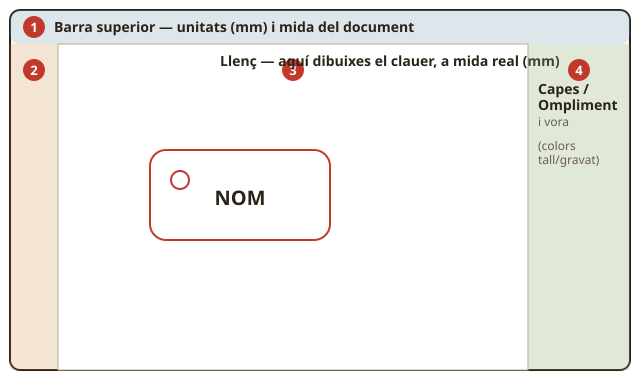
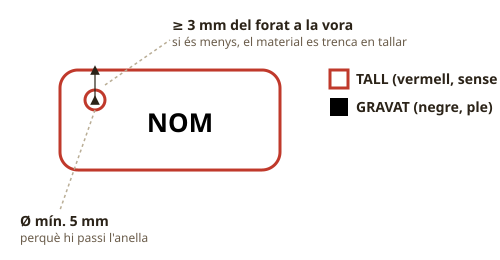

# 🖥️ Guia pas a pas: el meu primer disseny amb Inkscape (el clauer, SA1)

> Aquesta guia és per a la **Sessió 2** de `Classes/SA1_Benvinguts_Aula_Maker/SA1.md` — el dia
> que passes el teu **esbós en paper** a l'ordinador. Si encara no tens l'esbós acotat i amb els
> colors de tall/gravat marcats, acaba'l primer (10 min): digitalitzar sense decisions preses és
> fer la feina dos cops.
>
> 📸 **Nota per al docent:** els requadres marcats així indiquen on convé enganxar una
> **captura de pantalla real** feta durant la demo a classe (amb la versió d'Inkscape i l'idioma
> que teniu instal·lats als Chromebooks) — no s'han pogut generar captures reals des d'aquí. Els
> dos esquemes d'aquesta guia (`Recursos/imatges/guia_inkscape_pantalla.svg` i
> `Recursos/imatges/guia_inkscape_capes_forat.svg`) són dibuixos explicatius, no captures.

## Abans de començar
- [ ] Tinc el meu **esbós en paper acotat**, amb el vermell (tall) i el negre (gravat) marcats.
- [ ] He obert la carpeta `SA1/` del Drive del meu equip (si no la trobes, torna a
  `SA1.md` — sessió 2, pas 1).
- [ ] Sé quin és el meu repte: forma + nom + un detall + forat per l'anella, mida orientativa
  **60 × 25 mm** (`Fitxa_alumnat.md`).

## 🗺️ Coneix la pantalla d'Inkscape

1. **Barra superior** — aquí veuràs i canviaràs les **unitats (mm)** i la mida de qualsevol
   forma que tinguis seleccionada.
2. **Eines** (columna esquerra) — rectangle, el·lipse, text… la que facis servir més.
3. **Llenç** (centre) — el "full" on dibuixes, a **mida real**.
4. **Ompliment i vora / Capes** (dreta) — on decideixes si una forma és vermella (tall) o
   negra (gravat).

📸 *[CAPTURA 1: finestra d'Inkscape acabada d'obrir, amb aquestes 4 zones visibles]*

## Pas 1 — Posa el document en mil·límetres

1. Ves a **Fitxer → Propietats del document** (o `Ctrl+Shift+D`).
2. A "Unitats de visualització", tria **mm**.
3. Tanca el diàleg.

> ⚠️ **Per què és tan important:** si et deixes aquest pas, pots dibuixar un clauer que sembli
> bé a la pantalla però que en realitat sigui gegant o minúscul. El **Semàfor de fabricació**
> (`Recursos/Semafor_maker.md`, llum 1) comença precisament comprovant les mides reals.

📸 *[CAPTURA 2: diàleg de Propietats del document amb "mm" seleccionat]*

## Pas 2 — Dibuixa la forma base

1. Tria l'eina **Rectangle** (tecla `R`) o **El·lipse** (tecla `E`), segons la forma del teu
   esbós.
2. Fes clic i arrossega dins el llenç per dibuixar-la — no cal encertar la mida a la primera.
3. Amb la forma seleccionada (eina fletxa, tecla `S` o `Esc`), mira la **barra superior**: hi
   apareixen `A` (amplada) i `H` (alçada). Escriu-hi les mides del teu esbós (per exemple
   `60` i `25`, en mm) i prem `Retorn`.
4. Si vols cantonades arrodonides en un rectangle, arrossega el petit cercle groc de la
   cantonada cap endins.

> 💡 **Truc:** si la forma es deforma en canviar la mida, comprova el **cadenat** 🔒 al costat
> d'`A`/`H` — tancat manté la proporció (útil), obert et deixa canviar amplada i alçada per
> separat (el que necessites aquí, perquè el clauer no és quadrat).

📸 *[CAPTURA 3: rectangle acabat de dibuixar, amb els camps A/H de la barra superior visibles]*

## Pas 3 — Afegeix el teu nom

1. Tria l'eina **Text** (tecla `T`).
2. Fes clic dins el llenç (a sobre de la forma, on aniria al teu esbós) i escriu el teu nom o
   inicial.
3. Amb l'eina fletxa, selecciona el text i mou-lo/centra'l a ull sobre la forma.
4. Si és massa gran o massa petit, torna a l'eina fletxa i canvia la mida com feies amb la
   forma (o des de la barra superior de l'eina text).

> 🧭 **Recorda el repte del full de paper:** si vols lletres **calades** (que la làser talli el
> forat de dins d'una O o una A), han de tocar-se amb el contorn o entre elles — si no, aquest
> tros de material cau en tallar. És el mateix truc que vas provar en paper.

📸 *[CAPTURA 4: text amb el nom, ja col·locat sobre la forma]*

## Pas 4 — Afegeix un detall que t'identifiqui

Un dibuix senzill, una estrella, una icona… el que hagis decidit al teu esbós. Pots fer-lo amb
l'eina **Estrella** (a la barra d'eines, prop del rectangle) o amb formes bàsiques combinades.
No cal que sigui complicat: un detall petit i clar es llegeix millor gravat que un de molt
elaborat.

## Pas 5 — Fes el forat de l'anella

1. Amb l'eina **El·lipse** (`E`), dibuixa un cercle petit a prop d'una vora (mentre dibuixes,
   prem `Ctrl` per fer-lo perfectament rodó).
2. Selecciona'l i posa'n la mida des de la barra superior: **Ø mínim 5 mm** perquè hi passi
   l'anella.
3. Comprova la distància a la vora **a ull i amb regla si cal**: ha de quedar a **3 mm o més**
   del contorn — si queda més a prop, aquest tros de material és massa fi i es trenca en tallar.

📸 *[CAPTURA 5: forat de l'anella dibuixat, prop de la vora]*

## Pas 6 — Marca què és tall i què és gravat (el codi de colors)

Aquest és el pas que la làser necessita per saber què fer amb cada línia. És el **mateix codi
de colors** que vas fer servir en paper:

- 🔴 **TALL** = contorn de la forma + el forat → **vermell pur, sense ompliment**, línia fina.
- ⚫ **GRAVAT** = el nom + el detall → **negre, amb ompliment** (ple, no només la vora).

**Com fer-ho:**

1. Selecciona el **contorn** de la forma i el **forat**.
2. Obre **Objecte → Ompliment i vora** (`Ctrl+Shift+F`).
3. A la pestanya **Ompliment**, tria "Sense pintura" (la X).
4. A la pestanya **Vora**, tria el vermell pur (**R 255, G 0, B 0** — pots escriure-ho al camp
   RGBA) i baixa el **gruix de la vora** a un valor petit (~0,1 mm).
5. Ara selecciona el **nom** i el **detall**: a "Ompliment", tria negre pur
   (**R 0, G 0, B 0**); no calen canvis a la vora.

> 🗂️ **Vols fer-ho amb capes en comptes de només colors?** Pots crear dues capes des de
> **Capa → Afegeix una capa…**, anomenar-les `TALL` i `GRAVAT`, i arrossegar-hi cada element
> (mou un objecte a la capa activa amb `Maj+Pàg.Amunt/Pàg.Avall`). És exactament així com està
> feta la plantilla `Recursos/Plantilles_disseny/clauer_SA1.svg`, per si la vols obrir per
> veure-ho fet.

📸 *[CAPTURA 6: diàleg d'Ompliment i vora, amb el contorn en vermell sense ompliment]*

## Pas 7 — Converteix el text a camí

Aquest pas és imprescindible perquè el teu nom es grave igual encara que la làser faci servir
un altre ordinador (sense la mateixa font):

1. Selecciona el text del nom.
2. Ves a **Camí → Objecte a camí** (`Maj+Ctrl+C`).

A partir d'ara el "nom" ja no és text editable, és un dibuix — no el podràs corregir escrivint,
només movent els nodes. Per això és l'**últim** que fas, quan ja estàs content amb el text.

## Pas 8 — Passa el Semàfor abans de desar

Repassa les 3 llums de `Recursos/Semafor_maker.md` amb la teva parella abans d'avisar el/la
profe:

- [ ] 🟢 Mides reals en mm (les del teu esbós, no 10 vegades més grans o petites).
- [ ] 🟡 Tall en vermell pur sense ompliment, gravat en negre ple, text convertit a camí.
- [ ] 🔴 Nom del fitxer correcte i pujat al lloc correcte (pas següent).

## Pas 9 — Desa amb el nom correcte

1. **Fitxer → Anomena i desa** (`Ctrl+Maj+S`).
2. Desa'l com a **`ElMeuNom_SA1_v1.svg`** dins la carpeta `SA1/` del Drive del teu equip.
3. Avisa el/la profe perquè el revisi abans que entri al *batch* de fabricació.

---

## 🧯 Se m'ha embolicat alguna cosa?

Abans de cridar el/la profe, mira `Recursos/Primers_auxilis_maker.md` — recull els errors més
freqüents d'Inkscape (formes que no es mouen, colors que no canvien, capes perdudes…) amb la
solució. Desencallar-te sol/a també compta com a aprenentatge!

## 🎥 Vídeos i tutorials (per repassar a casa)

> ⚠️ **Per verificar pel docent abans de recomanar-los a l'alumnat** (condicions d'accés i
> idioma poden canviar; segueix el criteri de `Recursos/Enllacos_i_tutorials.md`):

- [Tutorial bàsic d'Inkscape en català (Softcatalà)](https://www.softcatala.org/programes/inkscape/)
  — llenç, formes i eines bàsiques, amb vocabulari en català.
- [10 primers passos a Inkscape — tutorial per a principiants (YouTube, castellà)](https://www.youtube.com/watch?v=7tUFhtIeOUQ)
  — repassa formes, text i exportar; útil per a qui vulgui veure-ho de nou en vídeo.
- [Com fer amb Inkscape un puzle per tall i gravat làser (Instructables, català)](https://www.instructables.com/Com-Fer-Amb-Inkscape-Un-Puzle-Amb-Una-Forma-Irregu/)
  — mateix codi de colors tall/gravat que fem servir al curs, amb un altre exemple.

## 🔍 Vocabulari d'aquesta guia
`mm` · `capa` · `ompliment` · `vora` (contorn) · `tall` · `gravat` · `camí` — definicions
completes a `Classes/SA0_Punt_de_partida/Vocabulari_basic.md`.
